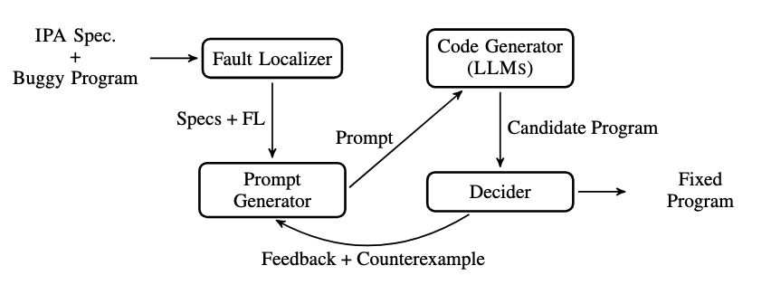

# Counterexample Guided Program Repair Using Zero-Shot Learning and MaxSAT-based Fault Localization

This is the implementation of _Counterexample Guided Program Repair Using Zero-Shot Learning and MaxSAT-based Fault Localization_ [1] accepted at AAAI 2025.

In this work, we propose a novel approach that combines the strengths of both Formal Methods (FM)-based fault localization and Large Language Models (LLMs), via zero-shot learning, to enhance Automated Progra Repair (APR) for introductory programming assignments (IPAs).

Our method uses MaxSAT-based fault localization to identify buggy parts of a program, then presents the LLM with a program sketch devoid of these buggy statements.
This hybrid approach follows a Counterexample Guided Inductive Synthesis (CEGIS) loop to iteratively refine the program. We ask the LLM to synthesize the missing parts, which are then checked against a test suite.
If the suggested program is incorrect, a counterexample from the test suite is fed back to the LLM for revised synthesis.

## REQUIREMENTS

All the python requirements are in the requirements.txt file.

### EXPERIMENTS

Our work has been evaluated using one benchmark of C programs: _C-Pack-IPAs_ [2]. C-Pack-IPAs is a set of student programs collected during an introductory programming course for twenty-five assignments over three distinct academic years, comprising 1431 faulty programs.

For the fault localization module we used _CFaults_ [3], which is a Formula-Based Fault Localization in C with Multiple Test Cases.

**************************

## RESULTS

Our results can be found in a [sqlite3](https://docs.python.org/3/library/sqlite3.html) database in [database/aaai25-results.db](database/aaai25-results.db).

## SCRIPTS

- `repair_CPackIPAs.sh`

  Calls our LLM-based repair agent on the C-Pack-IPAs dataset.
  This script can be run with the -h flag to display a help message.

- `repair.py`

   LLM-based repair using BentoML servers.

- `how_to_run_RepairAgents.sh`

   Commands to run all the RepairAgents.

- `how_to_run_LLMs.sh`

   Commands to launch all LLMs in different GPUs.

- `LLMs/`

   Contains the BentoML servers for each different LLM.

- `mentor/`

   Contains several python3 classes that help in the repair process.

## AVAILABILITY

The source code for this work is also publicly available at [https://github.com/pmorvalho/LLM-CEGIS-Repair](https://github.com/pmorvalho/LLM-CEGIS-Repair).

This repository should not be used to reproduce the paper, but it contains the current version of our code and will continue to be developed and shared with the research community.

## REFERENCES

[1] P. Orvalho, M. Janota, and V. Manquinho. Counterexample Guided Program Repair Using Zero-Shot Learning and MaxSAT-based Fault Localization. In the 39th Annual AAAI Conference on Artificial Intelligence, AAAI 2025. [PDF](https://web.ist.utl.pt/pmorvalho/papers/aaai25-LLM-CEGIS-Repair.pdf).

[2] P. Orvalho, M. Janota, and V. Manquinho. C-Pack of IPAs: A C90 Program Benchmark of Introductory Programming Assignments. In the 5th International Workshop on Automated Program Repair, APR 2024, co-located with ICSE 2024. [GitHub](https://github.com/pmorvalho/C-Pack-IPAs). [PDF](https://web.ist.utl.pt/ist181151/papers/apr24-paper.pdf).

[3] P. Orvalho, M. Janota, and V. Manquinho. CFaults: Model-Based Diagnosis for Fault Localization in C with Multiple Test Cases. The 26th International Symposium on Formal Methods, FM 2024. [GitHub](https://github.com/pmorvalho/CFaults). [PDF](http://web.ist.utl.pt/pmorvalho/papers/fm24-paper.pdf).
